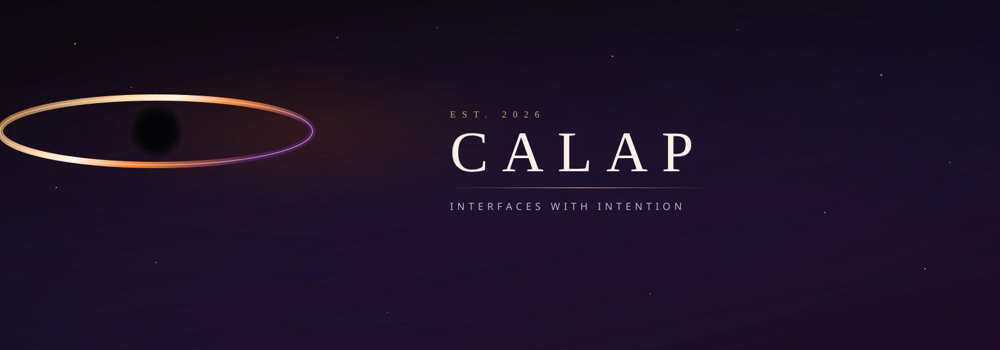
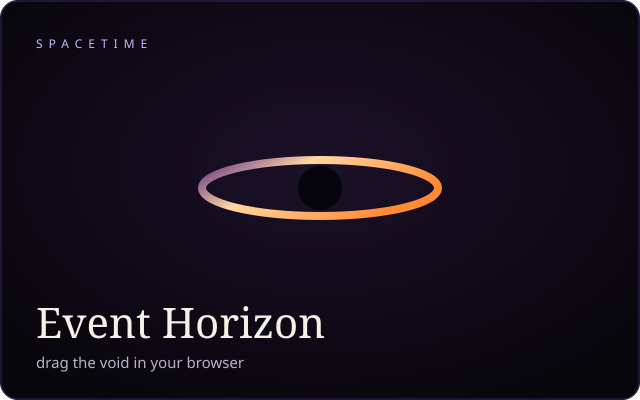

  
  
  

    <em>Small sites with a strong mood.</em> 
    Spacetime you can drag · journals that stay quiet · catalogs that feel like a streamer.
  

 

<table width="100%">
  <tr>
    <td width="50%" valign="top">
      
    </td>
    <td width="50%" valign="top">
      
    </td>
  </tr>
  <tr>
    <td width="50%" valign="top">
      
    </td>
    <td width="50%" valign="top">
      
    </td>
  </tr>
</table>

 

  
    
  
  
    
  
    
  <picture>
    <source media="(prefers-color-scheme: dark)" srcset="https://raw.githubusercontent.com/calap0309/calap0309/output/github-snake-dark.svg">
    <source media="(prefers-color-scheme: light)" srcset="https://raw.githubusercontent.com/calap0309/calap0309/output/github-snake.svg">
    
  </picture>

